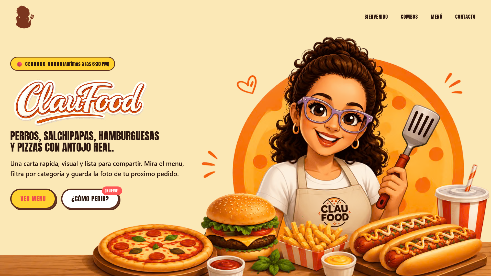

# 🍔 Clau Food — MVP de carta digital para negocio local

> Menú visual para pedir perros, salchipapas, hamburguesas, asados y pizzas.  
> Filtros, captura de productos y pedido directo por WhatsApp.

<div align="center">

[](https://github.com/MiroDev20/clau-food) [](LICENSE)

</div>

---

## ✨ Características principales

- 📱 **MVP móvil-first** — Interfaz diseñada para dispositivos móviles y desktop.
- 🔍 **Filtrado activo** — Navega rápido por categorías: Perros, Salchipapas, Hamburguesas, Asados y Pizzas.
- 📸 **Captura de producto** — Genera una imagen de pedido para compartir o enviar por WhatsApp.
- 📦 **Menú en JSON** — Productos y combos fáciles de actualizar sin tocar la lógica principal.
- 📬 **Pedido por WhatsApp** — Enlace directo para enviar la selección al negocio.
- ⚡ **Bundle optimizado** — Generado con `esbuild` para carga rápida.
- ♿ **Accesibilidad** — Navegación por teclado y atributos ARIA básicos.
- 🧠 **SEO básico** — Schema.org, `robots.txt` y `sitemap.xml`.

---

## 🖥️ Vista previa



---

## 🚀 Tecnologías utilizadas

| Tecnología | Propósito |
|------------|-----------|
| HTML5 + CSS3 | Estructura y estilos |
| JavaScript (ES6+) | Lógica interactiva |
| [esbuild](https://esbuild.github.io/) | Empaquetado y minificación |
| [Cloudinary](https://cloudinary.com/) | Alojamiento y optimización de imágenes |
| LocalStorage + SessionStorage | Caché de datos y preferencias |
| GitHub Pages (opcional) | Hosting estático |

---

## 📁 Estructura del proyecto

```
clau-food/
├── assets/
│   ├── bundle.js            # Bundle compilado por esbuild
│   ├── combos.json          # Datos de combos
│   ├── menu.json            # Datos del menú completo
│   └── preview.png          # Imagen de vista previa para el README
├── docs/                   # Documentación técnica adicional
├── services/
│   ├── business-hours.js
│   ├── combos-load.js
│   ├── header-menu.js
│   ├── main.js              # Entrada principal para esbuild
│   ├── menu-featured.js
│   ├── menu-filter.js
│   ├── menu-load.js
│   ├── menu-utils.js
│   ├── notifications.js
│   ├── order-tutorial.js
│   ├── product-snapshot-renderer.js
│   └── product-snapshot.js
├── styles/
│   └── index.css            # Estilos principales
├── index.html               # Página principal
├── menu.html                # Menú completo
├── package.json             # Dependencias y scripts
├── package-lock.json        # Dependencias bloqueadas
├── robots.txt               # Instrucciones para crawlers
├── sitemap.xml              # Mapa del sitio
├── LICENSE                  # Licencia del proyecto
└── README.md                # Este archivo
```

---

## 🛠️ Instalación y uso local

```bash
# 1. Clona el repositorio
git clone https://github.com/MiroDev20/clau-food.git
cd clau-food

# 2. Instala las dependencias
npm install

# 3. Genera el bundle optimizado
npm run build

# 4. Sirve el sitio localmente
python3 -m http.server 8000
# Luego visita http://localhost:8000
```

> **Nota:** Los archivos HTML cargan `assets/bundle.js`. Si modificas código en `services/`, ejecuta `npm run build` para regenerar el bundle.

---

## 🧪 Scripts disponibles

En `package.json`:

```json
"scripts": {
  "build": "esbuild services/main.js --bundle --outfile=assets/bundle.js --format=esm --minify",
  "dev": "esbuild services/main.js --bundle --outfile=assets/bundle.js --format=esm --watch",
  "test": "echo \"Error: no test specified\" && exit 1"
}
```

- `npm run build` — Crea `assets/bundle.js` en modo producción.
- `npm run dev` — Reconstruye automáticamente el bundle cuando hay cambios en `services/`.

---

## 📦 Datos del menú

Los datos del menú se centralizan en JSON:

- `assets/menu.json` — productos individuales
- `assets/combos.json` — combos disponibles

Ejemplo de producto:

```json
{
  "id": 1,
  "ruta": "https://res.cloudinary.com/.../imagen.webp",
  "nombre": "Perro sencillo",
  "categoria": "perros",
  "descripcion": "Perro caliente clásico",
  "precio": 6500
}
```

Esta arquitectura permite actualizar la carta sin tocar la lógica de renderizado.

---

## 🎯 Enfoque del proyecto

Clau Food es un MVP de carta digital para negocio local. La solución está diseñada para presentar el menú de manera clara, facilitar pedidos por WhatsApp y actualizar la oferta rápidamente desde archivos JSON.

Este MVP es ideal para:
- restaurantes pequeños y food trucks,
- servicios de comida a domicilio por WhatsApp,
- negocios que buscan una carta digital rápida sin backend.

---

## 📄 Documentación adicional

El repositorio incluye documentación técnica en `docs/`:
- `docs/alcance.md`
- `docs/arquitectura.md`
- `docs/casos-de-uso.md`
- `docs/flujo-sistema.md`
- `docs/modelo-dominio.md`
- `docs/modelo-entidad-relación.md`
- `docs/requerimientos.md`
- `docs/visión.md`

---

## 🤝 Contribuciones

Si deseas mejorar el proyecto:
1. Haz fork del repositorio.
2. Crea una rama con un nombre claro: `git checkout -b feature/nombre`.
3. Haz tus cambios y haz commit con mensajes descriptivos.
4. Envía un Pull Request.

---

## 📄 Licencia

Este proyecto está bajo la licencia **MIT**. Consulta el archivo [LICENSE](LICENSE) para más detalles.

---

## 📬 Contacto

- **WhatsApp:** [+57 324 4840556](https://wa.me/+573244840556)
